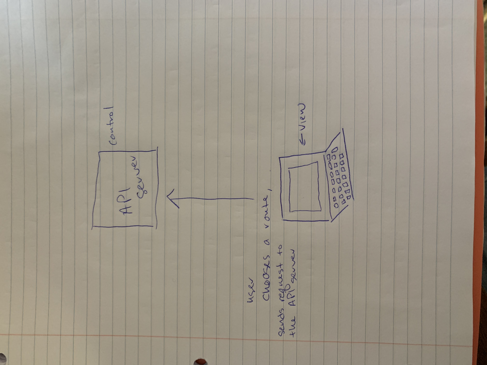

# resty

# stories
As a user, I expect an easy to read and understand user interface so that I can use the application intuitively
As a user, I want to enter the URL to a REST API and select the REST method to use to access it
As a user, I want visual confirmation that my entries and selections are valid so that I have confidence the application will be able to fetch the API data that I’ve requested

And as developers, here are the high level development tasks that address the above end user requirements
- Create a visually appealing site with a Header, Footer, and a large content area
- Create a form that asks for a URL
- Create buttons that let the user choose from the REST methods (get, post, put, delete)s

# UML
